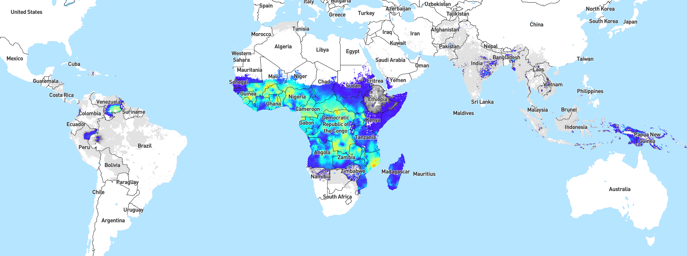
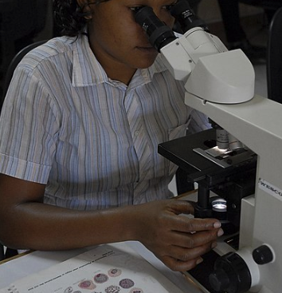

```{r setup, include = FALSE, eval=T}
knitr::opts_chunk$set(echo = T, eval = T, message = F, warning = F, out.extra = 'class="plot"', fig.align = "center")

```

<!-- Output document and get some style pointers taken largely from this stackexchange answer below
with a few minor tweaks to the js code 
https://stackoverflow.com/questions/37755037/how-to-add-code-folding-to-output-chunks-in-rmarkdown-html-documents -->

<script src="js/hideAll.js"></script>

# Acknowledgements
The `hrp2malaRia` package was written by [OJ Watson](https://github.com/OJWatson), a PhD Student with the Imperial College of London Mathematical Modeling group. This package was used in his recent [Elife Publication](https://www.ncbi.nlm.nih.gov/pubmed/28837020), Watson OJ _et al._ 2017, **Modelling the drivers of the spread of Plasmodium falciparum hrp2 gene deletions in sub-Saharan Africa**. Many of the ideas and theories that we will be discussing today were spear-headed by UNC Physician-Scientist, Jonathan Parr, along with OJ Watson and Steve Meshnick. 
    
Additional thanks to Dayne Filer, Mike Fliss, and Sara Levintow for hacks.
  
# Overview


## Using this document

* R code chunks have a grey background 
* Ouptputs can be "toggled" show/hide using the `show` button on the right after the code
* While you can copy and paste this code into R, you will learn faster if you type out the commands yourself. 
* I have asked that you install several packages, including: `remotes`. `tidyerverse`, `RColorBrewer`, and `cowplot`. We will be using `remotes` to install some packages from Github as well. 
* Throughout the document, I have placed questions indicated by a line. As before, we suggest that you work on this with a partner, and answer the questions below (space is given, indicated by a line).  But feel free to work on your own if you prefer. We will likely break frequently to discuss results. 


# Epidemiological & Biological Context

## Malaria Burden

_P. falciparum_ malaria is an infectious disease with a huge global burden, primarily concentrated in Africa. For an interactive map of _P. falciparum_ prevalence, see the [Malaria Atlas Project](https://map.ox.ac.uk/explorer/#/). 
<center>

<center>

## Malaria Life Cycle 

The malaria life cycle is complex with several different stages. For the purposes of this exercise, it is only important to note that the malaria parasite is transmitted by a mosquito vector that infects the human-host.


  
## Malaria Detection

In clinical and field settings, malaria is often diagnosed with either the use of light microscopy or rapid diagnostic tests (RDTs). In both cases, a finger-prick of blood is taken from patients and used to screen for malaria. Confirmation of infection by microscopy is made with direct visualization of the parasite by an expert microscopist while RDTs provide a "yes/no" result and can be performed by relatively anyone. 
  
RDTs detect parasite antigens (e.g. a parasite-specific marker) from the patient's peripheral blood. In the case of the _P. falciparum_, the vase majority of _Pf_-RDTs detect a _P. falciparum_ specific protein, histidine-rich protein 2 (hrp2).    
  
However, recent evidence has accumulated to suggest that _P. falciparum_ parasites have undergone selection for hrp2-gene deletions, making them no longer detectable by many RDTs ("stealth parasites"). In theory, by avoiding detection, parasites can then remain untreated and have a higher likelihood of spreading. 
  
Note, for the purposes of our discussions, we will ignore differences between the lower-limits of detection (and sensitivity/specificity) of these two diagnostic modalities. 
  
<!-- Note, here I am using some css code to make columns and insert figures -->

<center>



<center>


## Scenario
You are an Officer in the CDC's elite Epidemic Intelligence Service (EIS) Malaria Branch. One day, you are called by a concerned ministry of health official from a Sub-Saharan Africa country stating that their hospitals have seen several patients that had a classic clincial picutre of malaria but a negative rapid diagnostic test (RDT) at admission. Moreover, these same patients were positive for malaria by microscopy. The ministry of health official has already contacted the WHO and confirmed that their RDT stock was not defective. In addition, they have read recent reports of _hrp2_ deletions in South America and are now concerned that the problem may have spread to Sub-Saharan Africa. They ask for your help to  predict where they should be on the lookout for _hrp2_ deletions. 


## Hypothesis Generating
Before we began, discuss the following points with your neighbors (or as a group):   

1. If you were asked to a design an antigen-based detection method, what type of antigen would you pick (e.g. from an evolutionary point of view, what type of proteins/markers would be best)? _________________________________________________________

2. Do you expect for parasite transmission intensity to affect the prevalence of hrp2 deletions (hint: think about superinfections)?  
    * Why (or Why not)?   _____________________________
    * If you have multiple infections, what may be required of all them to go undetected? _______________________
    
3. How does virulence affect survelliance and detection efforts (assuming that increasing levels of virulence as associated with increasingly worse symptoms)? _________________________
    * How does virulence affect the asymptomatic reservoir?   _____________________________


## Model Specification
In the previous exercise led by Dr. Nunn, you first fit a deterministic SIR model to analyze the spread of a "childhood disease" through a susceptible population. You then extended your deterministic SIR model to include fluctuations in the population size through births and deaths (e.g. a demographic model). Next, you modeled the uncertainty and the variation in your model through simulation using a stochastic approach. As a reminder, stochastic individual-based models essentially follow individuals through the different model compartments and record the amount of time the spend in each state as they move through the simulation. In short, a deterministic model is a "closed-system" where we will arrive at the same answer every time (given the same parameters, initial conditions, etc), while, a stochastic model allows us to simulate many possible iterations of our model and directly express the randomness (or really uncertainty) of our parameters and outcome. 

In this exercise, we are going to use an individual-based, stochastic malaria transmission model that is an extension of the "Imperial Model" (see OJ's [Material & Methods](https://www.ncbi.nlm.nih.gov/pubmed/28837020)) for a full description that was based on Griffin et al. 2014, 2015, 2016).    
  
Refer to Figure 5 from OJ's [manuscript](https://www.ncbi.nlm.nih.gov/pubmed/28837020). What kind of compartment model is the "hrp2-Imperial Model"? ______________________   
  
Note, for the purpose of this exercise, we are going to ignore some of the (beautiful) complexities of the model and instead talk about this model in a Susceptible-Infected-Recovered-Susceptible framework (i.e. the U,A,D compartments are collapsed into the "Infected" category and Recovered corresponds to the period of active treatment/prophylaxis -- the T,P compartments -- when individuals are "immune"). Can you think of another scenario where you would potentially use a SIRS model (hint: think about your tetanus vaccines)? __________________  


### Variables of Interest
Please now open the `hrp2malaRia` package [README](https://github.com/OJWatson/hrp2malaRia) and read the **Input Variables to Change** and the **Output Variables of Interest**. 


#### Our Simulated World
For the purpose of this exercise, we are going to make some additional simplifying assumptions in order to use a subset of the parameters that were used in Watson et al. 2017.  
First, we are going to assume that if an RDT is negative due to _hrp2_-deletions, that individual will not receive treatment (NB, in a clinical setting, treatments are often empiric even if a test result is negative). Second, we are going to assume that there is no cross-reactivity of other _hrp_ antigens. These simplifying assumptions will be expressed in our model by setting the following parameters to 0: `rdt.nonadherence = 0, rdt.det = 0`. 
  
##### Constants
For the purpose of this exercise, we are always going to perform simulations of a population of 2,000 indiviudals over a 20-year timespan. In addition, we will assume that at the start of the simulation, there is a 10:1 ratio of wild-type _P. falciparum_ strains to _hrp2_-deleted strains. Finally, all outputs will be considered for individuals under 5-years of age, as those individuals carry the heaviest burden of malaria infections. 

##### Input Variables to Change
We are going to be focusing on a few parameters of the "hrp2-Imperial Model", namely:  

* EIR ("The entomological inoculation rate, or the number of infectious mosquito bites per person per year -- Transmission intensity")
* ft ("Proportion of cases seeking treatment")
* microscopy.use ("Proportion of cases diagnosed with microscopy vs. an RDT")
* fitness ("Relative chance of passing on an _hrp2_-deleted strain versus a WT strain")
  
##### Outputs of Interst
The `hrp2_Simulation` function returns many results that allow for many different questions to be investigated. For the purpose of our exercise, we will focus on the changes in _hrp2_-deletion frequency (`S.N.Dels.05`), incidence (`S.Incidence.05`), and proportion of infections that contain only _hrp2_-deleted parasites (`S.Prev.Mono.D.05`) among children under 5-years of age over time (`S.Times`)  


  
# Let's Get Started
## Installation
First you will need to make sure that you have the several packages installed. The command below installs any of those needed packages that you may be missing. It then uses the `remotes` package (an excellent resource for _R developers_) to install OJ's package from GitHub. In addition, we will install some functions that I made for this lab (`EMSI2019hrp2lab`) and the `furrr` package, which will give us some needed computational-speed later. Note, I set a seed below so that my script reproduces the same results every time. For the purpose of this exercise, do not set a seed and instead appreciate the variation in the stochastic models. 

```{r}
# check to make sure user has the needed packages; if missing, install for them 
list.of.packages <- c("tidyverse", "remotes", "cowplot", "RColorBrewer")
new.packages <- list.of.packages[!(list.of.packages %in% installed.packages()[,"Package"])]
if(length(new.packages)) install.packages(new.packages)


remotes::install_github("OJWatson/hrp2malaRia")
remotes::install_github("nickbrazeau/EMSI2019hrp2lab") # hacky way to download this tutorial as a package
remotes::install_github("DavisVaughan/furrr") # we are going to use this for speed later
library(hrp2malaRia)
library(EMSI2019hrp2lab)
library(furrr)
library(tidyverse)
library(RColorBrewer)
library(cowplot)

set.seed(42) # please don't run this line! 
```


# Scenario 1: Differences in Diagnostics
Imagine that there are three populations with a constant EIR of 1 and the _hrp2_-deleted and WT strains have equal fitness. In addition, in all three populations cases seek care 50% of the time. However, the populations differ by:  
  
**Population 1:**

* Only uses rapid diagnostic tests (RDTs) to diagnose malaria


**Population 2:**

* Uses RDTs to diagnose 50% of cases and microscopy for the other 50%

**Population 3:**

* Only uses microscopy to diagnose malaria


  
Let's run the code (once) and plot the result: 


```{r}
# Simulations with N = 2000 take ~1 minute to run on my MacBook Pro (3.1 GHz Intel Core i7)

# Population 1
senario1.pop1 <-     hrp2malaRia::hrp2_Simulation(N=2000, 
                                                  years=20, 
                                                  strains.0 = 10,
                                                  microscopy.use = 0, 
                                                  EIR=1/365, 
                                                  ft = 0.5,
                                                  fitness = 1,
                                                  rdt.det = 0, 
                                                  rdt.nonadherence = 0
                                                  )
# Population 2
senario1.pop2 <-     hrp2malaRia::hrp2_Simulation(N=2000, 
                                                  years=20, 
                                                  microscopy.use = 0.5, 
                                                  EIR=1/365, 
                                                  ft = 0.5,
                                                  fitness = 1,
                                                  strains.0 = 10,
                                                  rdt.det = 0, 
                                                  rdt.nonadherence = 0
                                                  )


# Population 3
senario1.pop3 <-      hrp2malaRia::hrp2_Simulation(N=2000, 
                                                   years=20, 
                                                   microscopy.use = 1, 
                                                   EIR=1/365, 
                                                   ft = 0.5,
                                                   fitness = 1,
                                                   strains.0 = 10,
                                                   rdt.det = 0, 
                                                   rdt.nonadherence = 0 
                                                   )


# Now, let's plot these - all variables that begin with S. are series variables collected over time. 
# let's plot the first population
plot(senario1.pop1$S.Times,senario1.pop1$S.N.Dels, xlab = "time (days)", ylab = "hrp2 deletion Frequency", ylim=c(0,1), col="red", type="l", lwd=2)
# and add the second population
lines(senario1.pop2$S.Times, senario1.pop2$S.N.Dels,lwd=2, col="blue")
# and add the third population
lines(senario1.pop3$S.Times, senario1.pop3$S.N.Dels,lwd=2, col="green")
# and add our legend
legend(2000, .25, legend=c("Only RDT use", "50% RDT use", "0% RDT Use"),
       col=c("red", "blue", "green"), lty=1, cex=0.8,
       box.lty=2, box.lwd=2)

```


### Advanced Content
Given that this is a stochastic model, there will be run-to-run variability of each model iteration. This variability is important in quantifying our uncertainty of the stochastic processes that we are modeling.    

**To perform multiple runs of the model, you can simply copy and paste the code above (and rename the output objects [e.g. `r1.2`], as to not overwrite your previous results). Or, we can make a _map_ dataframe, where we specify the different parameters we want for each run and use this dataframe as the "captain" calling the "plays".**     

In this _map dataframe_, each row will be one iteration of our model. Columns will contain our parameter options and the cells will be the conditions, or options that we set, for each parameter within each model. Using a **map** file is a cornerstone of [functional programming](https://r4ds.had.co.nz/many-models.html) and a high-yield concept for reproducible research. Plus, as Dr. Nunn noted earlier, stochastic models are typically slower to run than deterministic models.  As a result, we now have a [need for speed](https://www.youtube.com/watch?v=odMO18xcVPs), which is made easier with a **map dataframe** that we can "loop" through. 
  
Why do you think stochastic models are typically slower to run than deterministic models? _____________________
  
  
#### More Advanced Content
We are going to use the `furrr` package to take advantage of the multiple processors on your computer (e.g. parallelize the simulations). This is simply for speed. If you are having trouble running the `furrr` package, you can change the `furrr::future_pmap` commands below to `purrr::pmap` and will get the same result (albeit at a slower pace). Or, you can just write out each model individually using the code above. 
  
  
Let's try our _map dataframe_  out below: 

```{r}

future::plan(multiprocess) # call forward for furrr

hrp2map <- data.frame(run = c(1,1,1, 2,2,2, 3,3,3),
                      N=2000, 
                      years=20, 
                      microscopy.use = c(0,0.5,1, 0,0.5,1, 0,0.5,1),
                      EIR=1/365, 
                      ft = 0.5,
                      fitness = 1,
                      strains.0 = 10,
                      rdt.nonadherence = 0, 
                      rdt.det = 0)
```

Let's look at what we just made: 
```{r}
dplyr::glimpse(hrp2map)
```
OK, let's run our models and store them in our **map dataframe**. 


```{r}

hrp2map$results <- furrr::future_pmap(hrp2map[, !colnames(hrp2map) %in% "run"], # note, we need to drop the run column as that is not an option for hrp2_Simulation
            hrp2malaRia::hrp2_Simulation) 


```


Now let's visualize our plots of the proportion of _hrp2_-deleted parasites over time.
```{r, fig.width = 11, fig.height = 11}

# note, I wrote this function for you, it returns a ggplot
plot.scenario1.run1 <- plothrp2models(pop1 = hrp2map$results[[1]],
                                      pop2 = hrp2map$results[[2]],
                                      pop3 = hrp2map$results[[3]],
                                      labels = c("Only RDT use", "50% RDT use", "0% RDT use")) # you need to manually add the labels

# you can manually add a title like this too 
plot.scenario1.run1 <- plot.scenario1.run1 + ggtitle("hrp2 Simulation Scenario 1, Run 1")


# now consider run 2
plot.scenario1.run2 <- plothrp2models(pop1 = hrp2map$results[[4]],
                                      pop2 = hrp2map$results[[5]],
                                      pop3 = hrp2map$results[[6]],
                                      labels = c("Only RDT use", "50% RDT use", "0% RDT use"))
plot.scenario1.run2 <- plot.scenario1.run2 + ggtitle("hrp2 Simulation Scenario 1, Run 2")

# now consider run 3
plot.scenario1.run3 <- plothrp2models(pop1 = hrp2map$results[[7]],
                                      pop2 = hrp2map$results[[8]],
                                      pop3 = hrp2map$results[[9]],
                                      labels = c("Only RDT use", "50% RDT use", "0% RDT use"))
                                      
plot.scenario1.run3 <- plot.scenario1.run3 + ggtitle("hrp2 Simulation Scenario 1, Run 3")

# Plot them together
cowplot::plot_grid(plot.scenario1.run1, 
                   plot.scenario1.run2,
                   plot.scenario1.run3,
                   ncol=1)


```

#### Questions for Simulation 1, differences in diagnostics

* How does the difference in diagnostic modality affect the proportion of _hrp2_-deleted parasites in the population? __________________
* How much variation did you appreciate between runs? __________________________________
* Was there anything unusual about your plots? Why was it unusual? _______________________________


# Scenario 2: Differences in Transmission Intensity 
Again, imagine that there are three populations that all only use RDTs for malaria diagnosis and the _hrp2_-deleted and WT strains have equal fitness. In addition, in all three populations cases seek care 50% of the time. However, the populations differ by:  
  

**Population 1:**

* EIR is 1 

**Population 2:**

* EIR is 10
  
**Population 3:**

* EIR is 100

```{r, fig.width = 11, fig.height = 11}
# going to overwrite our old hrp2map and make a new one

hrp2map <- data.frame(run = c(1,1,1,2,2,2),
                      N=2000, 
                      years=20, 
                      microscopy.use = 0,
                      EIR=c(1/365, 10/365, 100/365, 1/365, 10/365, 100/365),
                      ft = 0.5,
                      strains.0 = 10,
                      fitness = 1,
                      rdt.nonadherence = 0, 
                      rdt.det = 0
                      )


hrp2map$results <- furrr::future_pmap(hrp2map[, !colnames(hrp2map) %in% "run"], 
           hrp2malaRia::hrp2_Simulation)

plot.scenario2.run1 <- plothrp2models(pop1 = hrp2map$results[[1]],
                                      pop2 = hrp2map$results[[2]],
                                      pop3 = hrp2map$results[[3]],
                                      labels = c("EIR 1", "EIR 10", "EIR 100")) 
plot.scenario2.run1 <- plot.scenario2.run1 + ggtitle("hrp2 Simulation Scenario 2, Run 1")


plot.scenario2.run2 <- plothrp2models(pop1 = hrp2map$results[[4]],
                                      pop2 = hrp2map$results[[5]],
                                      pop3 = hrp2map$results[[6]],
                                      labels = c("EIR 1", "EIR 10", "EIR 100")) 
plot.scenario2.run2 <- plot.scenario2.run2 + ggtitle("hrp2 Simulation Scenario 2, Run 2")

cowplot::plot_grid(plot.scenario2.run1, plot.scenario2.run2,ncol=1)


```

#### Questions for Simulation 2, differing transmission intensities

* How do the differences in EIR affect the frequency of _hrp2_-deleted parasites? __________________
  * Do any of the models seem odd (e.g. are any "overwhelmed")? _________________________
* Compare these trends with the trends above (diagnostic differences) -- what differences and similarities can be appreciated? __________________________________
  * Why does a high EIR result in so few _hrp2_-deleted parasites? ___________________________
  * Are there parameter(s) that we could change in our simulation that would allow for a high EIR and still produce a high proportion of _hrp2_-deleted parasites? _________________________


# Scenario 3: Differences in Care-Seeking Behavior
Again, imagine that there are three populations that all only use RDTs for malaria diagnosis and have a constant EIR of 1. In addition, all populations have _hrp2_-deleted and WT parasites with equal fitness. However, the populations differ by:


  **Population 1:**

  * ft is 0

**Population 2:**

  * ft is 0.5

**Population 3:**

  * ft is 1

```{r, fig.width = 11, fig.height = 11}
# going to overwrite our old hrp2map and make a new one

hrp2map <- data.frame(run = c(1,1,1, 2,2,2),
                      N=2000,
                      years=20,
                      microscopy.use = 0,
                      EIR=1/365, 
                      ft = c(0,0.5,1, 0,0.5,1),
                      strains.0 = 10,
                      fitness = 1,
                      rdt.nonadherence = 0,
                      rdt.det = 0
)


hrp2map$results <- furrr::future_pmap(hrp2map[, !colnames(hrp2map) %in% "run"],
                                      hrp2malaRia::hrp2_Simulation)

plot.scenario3.run1 <- plothrp2models(pop1 = hrp2map$results[[1]],
                                      pop2 = hrp2map$results[[2]],
                                      pop3 = hrp2map$results[[3]],
                                      labels = c("No Care-Seeking", "50% Care-Seeking", "All Care-Seeking"))
plot.scenario3.run1 <- plot.scenario3.run1 + ggtitle("hrp2 Simulation Scenario 3, Run 1")


plot.scenario3.run2 <- plothrp2models(pop1 = hrp2map$results[[4]],
                                      pop2 = hrp2map$results[[5]],
                                      pop3 = hrp2map$results[[6]],
                                      labels = c("No Care-Seeking", "50% Care-Seeking", "All Care-Seeking"))
plot.scenario3.run2 <- plot.scenario3.run2 + ggtitle("hrp2 Simulation Scenario 3, Run 2")

cowplot::plot_grid(plot.scenario3.run1, plot.scenario3.run2,ncol=1)


```

#### Questions for Simulation 3, differing levels of care-seeking behavior among cases

* In our model, what is care-seeking behavior in terms of an "evolutionary concept" (e.g. what would you call an antibiotic in an antibiotic-resistance model)? ____________
* How does care seeking behavior affect the proportion of _hrp2_-deleted parasites? __________________
    * Is this consistent with what you expected? ______________________
* Compare these trends with the trends above (diagnostic differences and EIR differences) -- what differences and similarities can be appreciated? __________________________________


# Scenario 4: Differences in Fitness 
For the last time, imagine that there are three populations with a constant EIR of 1 and all populations only use RDTs for diagnosis. Further, imagine that 50% of the cases seek treatment in each population. However, the populations differ by: 

**Population 1:**

* There is a fitness cost associated with an _hrp2_-deletion (fitness = 0.8)

**Population 2:**

*  Euqal fitness for _hrp2_-deleted and WT parasites 
  
**Population 3:**

* There is a fitness benefit associated with an _hrp2_-deletion (fitness=1.2) *
  
\* Our group has hypothesized that _hrp2_-deleted parasites are less virulent and therefore more likely to contribute to the asymptomatic reservoir. We have modeled that here as a "boost" in fitness, as OJ's model codes fitness as "the probability that a strain is selected from the infectious pool". As such, we can increase or decrease the probability that the _hrp2_-deleted strain or the WT strain is propagated forward-in-time by our model (NB, this is a classic definition of fitness). Note, this is a bit of an abstraction from OJ's original model/fitness parameter.


```{r, fig.width = 11, fig.height = 20}
# going to overwrite our old hrp2map and make a new one

hrp2map <- data.frame(
                      run = c(1,1,1,2,2,2),
                      N=2000, 
                      years=20, 
                      microscopy.use = 0,
                      EIR=1/365, 
                      ft = 0.5, 
                      fitness = c(0.8,1,1.2, 0.8,1,1.2),
                      strains.0 = 10,
                      rdt.nonadherence = 0, 
                      rdt.det = 0
                      )


hrp2map$results <- furrr::future_pmap(hrp2map[, !colnames(hrp2map) %in% "run"], 
            hrp2malaRia::hrp2_Simulation)

plot.scenario4.run1 <- plothrp2models(pop1 = hrp2map$results[[1]],
                                      pop2 = hrp2map$results[[2]],
                                      pop3 = hrp2map$results[[3]],
                                       labels = c("hrp2 Fitness Cost", "hrp2 No Fitness", "hrp2 Fitness Benefit")) 
plot.scenario4.run1 <- plot.scenario4.run1 + ggtitle("hrp2 Simulation Scenario 4, Run 1")


plot.scenario4.run2 <- plothrp2models(pop1 = hrp2map$results[[4]],
                                      pop2 = hrp2map$results[[5]],
                                      pop3 = hrp2map$results[[6]],
                                      labels = c("hrp2 Fitness Cost", "hrp2 No Fitness", "hrp2 Fitness Benefit")) 
plot.scenario4.run2 <- plot.scenario4.run2 + ggtitle("hrp2 Simulation Scenario 4, Run 2")

cowplot::plot_grid(plot.scenario4.run1, plot.scenario4.run2,ncol=1)


```


#### Questions for Simulation 2 with regards to _hrp2_ frequency 

* How do the differences fitness affect _hrp2_ frequency? __________________
* Compare these trends to the trends above (diagnostics, EIR, treatment seeking)? __________________________________
  * Why (or why not) do you think that may be the case? ___________________________

# On Your Own
If you have time, run a few models that have multiple parameters that are different from those above. I recommend varying "fitness"" and "proportion of cases seeking treatment"" in order to see how they two variables collectively affect the overall frequency of _hrp2_-deleted parasites.


#  Incidence, Prediction, and Inference
By now, you have started to answer our Ministry of Health Official's question, as we have shown that populations with a high proportion of RDT use, low malaria transmission (low EIR), and a high proportion of cases seeking care are predictive of increases in _hrp2_-deletion frequency (Watson et al. 2017). In addition, we have shown that a large fitness cost is associated with the loss of _hrp2_-deleted parasites, but that in other cases of comparative fitness, _hrp2_-deleted parasites persist (or thrive) in the population (Watson et al. 2017, see Supp. Fig. 2). As a result, we can tell our Ministry of Health Official that regions with low-endemicity and large access to care are areas potentially most concerning for _hrp2_-deletions (of note, OJ's 2017 predictions have been pretty accurate to date, particularly in Eritrea and other regions in Northern Africa).    
   
    
However, our Ministry of Health Official asks the next logical question: "Should I continue using RDTs"?  
  
It is now a good time to note that this question mixes prediction and causal inference, both vast fields of study (the latter being the UNC Epi Department's forte). We are going to glaze over a huge number of assumptions and caveats (which I apologize for). 
  
  
Up until this point, we have been modeling the frequency (or proportion) of _hrp2_ parasites in each population. However, our question now asks about the utility of RDTs in a setting of _hrp2_ deletions. As such, we will take the "worst" possible scenario and compare two populations in a low EIR setting, where one population only uses RDT and all cases seek treatment versus a seperate population that only uses microscopy and all cases seek treatment. We will then focus in on differences in incidence between these two populations. 

```{r}
# I am only going to do one run, but feel free to do more

incidenceexmpl <- data.frame(N=2000, 
                             years=20, 
                             microscopy.use = c(0,1),
                             EIR=1/365, 
                             ft = 1,
                             fitness = 1,
                             strains.0 = 10,
                             rdt.det = 0,
                             rdt.nonadherence = 0)

incidenceexmpl$results <- furrr::future_pmap(incidenceexmpl, hrp2malaRia::hrp2_Simulation)

```

Let's now pull out the incidence data. 

```{r}

ret <- EMSI2019hrp2lab::extracthrp2results(pop1 = incidenceexmpl$results[[1]],
                                           pop2 = incidenceexmpl$results[[2]])

```

We can open it up to see what we extracted. Note, the _pfinc_ column is from the `hrp2malaRia` _.$S.Incidence.05_ column. 
```{r}
glimpse(ret)
```


```{r, fig.width = 11, fig.height = 8}

ret %>% 
  ggplot(.) +
  geom_line(aes(x=time, y=pfinc, group = factor(pop), colour=factor(pop))) +
  xlab("Times (Days)") + ylab("Incidence") + 
  scale_color_manual(name = "", labels = c("RDT/100% Care", "Microscopy/100% Care"), values = RColorBrewer::brewer.pal(8, "Set1")) +
    theme_minimal() +
    theme(
      plot.title = element_text(hjust=0.5),
      legend.position = "bottom"
    )

```

#### Preliminary Questions with regards to Incidence 

* Why is the incidence (through time) for both populations relatively low? How could you increase the incidence dramatically (by changing one parameter in the model code above)? _______________________
* Why are there fluctuations in incidence through time (hint: Think about weather in Sub-Saharan Africa)? ________________  

To answer this question, it may help to subset to just a year of "time". You could do this by adding the following to the code chunk above:  
`ret %>% dplyr::filter(time < 365) %>% # this would be the first year ggplot(.) + ...`  


Without going into too much detail, incidence is indexed by time (this is an "open population"", so we can't use "risk"). As a result, we can model the incidence difference between these two populations at each time-point in order to get a sense of how many more infections the "Only RDT Use, 100% Seek Care" population has as compared to "Only Microscopy Use, 20% Seek Care" population. 

```{r, fig.width = 11, fig.height = 8}

days <- seq(0, (365*20))

pop1 <- ret %>% 
  dplyr::filter(pop == 1)

pop2 <- ret %>% 
  dplyr::filter(pop == 2)

# quick local linear interpolation to get an incidence for every single day of the 20 years (not just the S.times)
pop1 <- approx(x = pop1$time, y = pop1$pfinc, xout = days, method = "linear") %>% 
  cbind.data.frame() %>% 
  dplyr::rename(time = x, pfinc = y) %>% 
  dplyr::mutate(pop = 1)

pop2 <- approx(x = pop2$time, y = pop2$pfinc, xout = days, method = "linear") %>% 
  cbind.data.frame() %>% 
  dplyr::rename(time = x, pfinc = y) %>% 
  dplyr::mutate(pop = 2)

# now let's rejoin and plot the difference

left_join(pop1, pop2, by = "time") %>% 
  dplyr::mutate(diff = pfinc.x - pfinc.y) %>% 
  dplyr::filter(!is.na(diff)) %>% # get rid of boundary issues ("cheating, we could do better")
  ggplot() +
  geom_line(aes(x=time, y=diff), color = "blue") + 
  geom_hline(yintercept = 0, color = "red") +
  xlab("Times (Days)") + ylab("Incidence") + 
  ggtitle("Incidence Difference between Population 1 and 2") +
    theme_minimal() +
    theme(
      plot.title = element_text(hjust=0.5),
      legend.position = "bottom"
    )


```

#### Questions with regards to Incidence Plot 

* What is your interpretation of the incidence difference plot above? _______________________

On your own, alter the simulation (e.g. vary EIR, etc.). How does the incidence difference plot change? What should you tell your Ministry of Health Official friend?
   
### Cost of a "False Negative"   
Although we can compare incidence differences directly (above), we should also consider the "cost" of a missed infection (e.g. an individual with _hrp2_ deleted parasites that was misdiagnosed by RDT, a "false-negative"). As a rough approximation, let's calculate the number of cases that we are missing in population 1 by using RDTs instead of microscopy. We will assume that population 2 has zero false-negatives. As such, the proportion of missed cases in population 1 from RDT-use can be approximated by multiplying incidence by the proportion of cases with only _hrp2_-deleted parasites minus the (baseline) of population 1. 
 

```{r}   

ret %>% 
  dplyr::filter(pop == 1) %>% # assume microscpy had no missed cases
  dplyr::mutate(missedprop = pfinc * hrp2prevmono) %>% 
  ggplot() +
  geom_line(aes(x=time, y=missedprop), color = "blue") + 
  xlab("Times (Days)") + ylab("hrp2-only Incidence") + 
  ggtitle("Incidence of hrp2 only infected individuals (missed case proportion)") +
    theme_minimal() +
    theme(
      plot.title = element_text(hjust=0.5),
      legend.position = "bottom"
    )


```

Now taking into account the "cost" of a potential missed infection, does your response to our Ministry of Health friend change?


# End 
Thank you for completing this lab!! 


