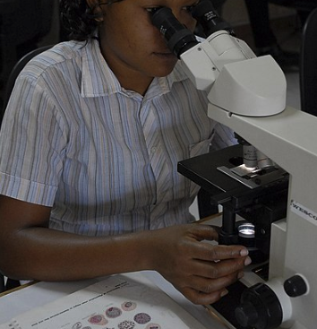

```{r setup, include = FALSE, eval=T}
knitr::opts_chunk$set(
  collapse = TRUE,
  comment = "#>",
  echo = T, eval = T, message = F, warning = F,
                      fig.align = "center",
                      out.extra = 'class="plot"')

```

<!-- Output document and get some style pointers taken largely from this stackexchange answer below
with a few minor tweaks to the js code 
https://stackoverflow.com/questions/37755037/how-to-add-code-folding-to-output-chunks-in-rmarkdown-html-documents -->

<script src="js/hideAll.js"></script>

# Acknowledgements
The `hrp2malaRia` package was written by [OJ Watson](https://github.com/OJWatson), a PhD Student with the Imperial College of London Mathematical Modeling group. This package was used in his recent [Elife Publication](https://www.ncbi.nlm.nih.gov/pubmed/28837020), Watson OJ _et al._ 2017, **Modelling the drivers of the spread of Plasmodium falciparum hrp2 gene deletions in sub-Saharan Africa**. The udeas and much of theory that we will be discussing today was spear-headed by UNC Physician-Scientist, Jonathan Parr. 
    
Additional thanks to Dayne Filer, Mike Fliss, and Sara Levintow for hacks.
  
# Overview

## Scenario
You are a field **Blah. Blah.**


## Using this document

* R code chunks have a grey background 
* Outputs for all R code can be "toggled" to the right of all code chunks
* While you can copy and paste this code into R, you will learn faster if you type out the commands yourself. 
* I have asked that you install several packages, including: `remotes`. `tidyerverse`, `RColorBrewer`, and `cowplot`. We will be using `remotes` to install some packages from Github as well. 
* Throughout the document, I have placed questions indicated by a line. As before, we suggest that you work on this with a partner, and answer the questions below (space is given, indicated by a line).  But feel free to work on your own if you prefer. We will likely break frequently to discuss results. 


# Epidemiological & Biological Context

## Malaria Burden

_P. falciparum_ malaria is an infectious disease with a huge global burden, primarily concentrated in Africa. For an interactive map of _P. falciparum_ prevalence, see the [Malaria Atlas Project](https://map.ox.ac.uk/explorer/#/). 
<center>

<center>

## Malaria Life Cycle 

The malaria life cycle is complex with several different stages. For the purposes of this exercise, it is only important to note that the malaria parasite is transmitted by a mosquito vector that infects the human-host.


  
## Malaria Detection

In clinical and field settings, malaria is often diagnosed with either the use of light microscopy or rapid diagnostic tests (RDTs). In both cases, a finger-prick of blood is taken from patients and used to screen for malaria. Confirmation of infection by microscopy is made with direct visualization of the parasite by an expert microscopist while RDTs provide a "yes/no" result and can be performed by relatively anyone. 
  
RDTs detect parasite antigens (e.g. a parasite-specific marker) from the patient's peripheral blood. In the case of the _P. falciparum_, the vase majority of _Pf_-RDTs detect a _P. falciparum_ specific protein, histidine-rich protein 2 (hrp2).    
  
However, recent evidence has accumulated to suggest that _P. falciparum_ parasites have undergone selection for hrp2-gene deletions, making them no longer detectable by many RDTs ("stealth parasites"). In theory, by avoiding detection, parasites can then remain untreated and have a higher likelihood of spreading. 
  
Note, for the purposes of our discussions, we will ignore differences between the lower-limits of detection (and sensitivity/speficity) of these two diagnostic modalities. 
  
<!-- Note, here I am using some css code to make columns and insert figures -->

<center>



<center>
  
  
### _hrp2_ Virulence
**Blah. Blah.**


## Prevalence & Multiplicity of Infection
In regions of high malaria prevalence, it is common for individuals to experience numerous innocuous bites every single evening. For example, in the Democratic Republic of the Congo, it is estimated that the average individual experiences [60-400 infectious mosquito bites/person/year*](https://www.pmi.gov/docs/default-source/default-document-library/malaria-operational-plans/fy-2018/fy-2018-democratic-republic-of-the-congo-malaria-operational-plan.pdf?sfvrsn=5). As a result of this intense burden, individuals can be infected with numerous different strains of malaria (termed "superinfection" -- note, for the purpose of this thought exercise we will ignore "co-transmission" events). 
  
* The number of infectious moquito bites per person per year is often termed the entomological innoculation rate (EIR) and is a measure of transmission intensity.
  
  
<center><center>


# Exercise Objectives
In this lab, we are going to explore different scenarios where hrp2 deletions are expected to increase in frequency (e.g. be "selected for") or decrease in frequency (e.g. be "selected against").
**Blah. Blah.**


## Hypothesis Generating
Before we began, discuss the following points with your neighbors (or as a group):   

1. If you were asked to a design an antigen-based detection method, what type of antigen would you pick (e.g. from an evolutionary point of view, what type of proteins/markers would be best)? _________________________________________________________

2. Do you expect for parasite prevalence, and particularly superinfections, to affect the prevalence of hrp2 deletions?  
    * Why (or Why not)?   _____________________________
    * If you have multiple infections, what may be required of all them to go undetected? _______________________
    
3. How can "silent" phenotypes be produced?
    * What are ways for a protein (e.g. a product of a gene) to be "removed"? _____________________
    * Would you expect a "fitness" cost be greater for a large deletion, a small deletion, or a silencing point mutation? _______________________________________


## Model Specification
In the previous exercise led by Dr. Nunn, you first used a determinist SIR model to analyze the spread of a "childhood disease" through a susceptible population. You then extended your deterministic SIR model to include fluctuations in the population size through births and deaths (e.g. a demographic model). Next, you modeled the uncertainty and the variation in your model through simulation using a stochastic approach. As a reminder, stochastic models essentially follow indiviudals through the different compartments of the model (and we record their states as they move through our model as outcomes). In short, a deterministic model is a "closed-system" where we will arrive at the same answer every time (given the same parameters, initial conditions, etc). In contrast, a stochastic model let's us simulate many possible iterations of our model and directly express the randomness (or really uncertainty) in our model paramters and outcome. 

In this exercise, we are going to use an individual-based, stochastic malaria transmission model that is an extension of the "Imperial Model" (see OJ's [Material & Methods](https://www.ncbi.nlm.nih.gov/pubmed/28837020)) for a full description via Griffin et al. 2014, 2015, 2016) OJ describes the Imperial Model fully.    
  
Refer to Figure 5 from OJ's [manuscript](https://www.ncbi.nlm.nih.gov/pubmed/28837020). What kind of Compartment Model is the "hrp2-Imperial Model"? ______________________   
  
Note, for the purpose of this exercise, we are going to ignore some of the (beautiful) complexities of the model and instead talk about this model in a Susceptible-Infected-Recovered-Susceptible framework (i.e. the U,A,D compartments are collapsed into the "Infected" category and Recovered corresponds to the period of active treatment/prophylaxis -- the T,P compartments -- when individusls are "immune"). What is another scenario that SIRS models can be applied to (hint: think about your tetanus vaccines)? __________________  
We are going to be focusing on a few adaptations of "hrp2-Imperial Model", namely:  

1. The addition of the parameter, $f\epsilon_T$, or "the probability that the clinical case yields a positive diagnostic result and subsequently receives treatment". Essentially, this parameter accounts for our "belief" in the RDTs by saying "given that you have clinical disease, will you go get treatment based on your RDT result"*. 
2. The contribution of _hrp2_ deleted versus wildtype strains to the mosquito infectious reservior (i.e. $C_D$, $C_U$, $C_T$).
3. The fitness of the _hrp2_ deleted versus wildtype strains. This parameter is modeled directly into the probability that a mosquito can transmit an _hrp2_ deleted parasite. Put simply, this essentially follows the classical defintion of fitness, as a probability that a given "gene" (here an hrp2 gene deletion) is passed on in subsquent generations. 


For each of the parameters listed above, which SIRS compartment will be most affected? ________________
  
  
\* Note, for the purpose of this exercise, we will ignore cross-reactivity of the _hrp3_ epitope by setting
$\epsilon$ to 0 and set RDT adherence to 100%. Put simply, this means that if an individual only contains _hrp2_ deleted parasites, they will not receive treatment (but if they contain any wildtype parasites, they may receive treatment depending on their probability of seeking treatment).


### Variables of Interest
This is copied from the [README]() that accompanies the `hrp2malaria` package instructions. Please note, this is a subset of potential input variables to change and the output variables of interest. 


#### Input Variables to Change

| Variable | Description                                                                   |
|----------|-------------------------------------------------------------------------------|
| *years* | Number of years simulation is run for. 20 years will be usually long enough to see hrp2 selection at low EIRs. |
| *N* | Population size. The model is stochastic and so a larger N will enable clearer patterns to be found in model outputs, however, they will take longer to run. Population of 2000 should be a good balance of speed and clarity for demonstration purposes. For the analysis in the eLife modelling paper N was set to 100,000 |
| *strains.0* | Starting ratio of strains in the population. This number must be an integer. The default is set to 10, which will mean that on initialisation there will be roughly 10 times as many wild type strains as there are hrp2 deleted. |
| *EIR* | Annual EIR, provided as a fraction, i.e. the default EIR of 20/365 represents an EIR of 20. |
| *ft* | Frequency of treatment being sought upon developing clinical disease. Must be a number between 0 and 1, with the default being 0.4, i.e. 40% of cases seek treatment. |
| *rdt.det* | The probability that an individual only infected with hrp2-deleted strains still produces a positive RDT. The default is 1, i.e. no selective pressure. For the eLife paper we used a value of 0.25 that represented the approximate 25% chance that a positive RDT would still be produced due to hrp3 protein epitope cross reactivity |
| r*dt.nonadherence* | The probability that the result of an RDT is ignored, i.e. a negative RDT due to hrp2 deletions will still be treated. Default = 0, and in the eLife paper we used a value of 10% based on data collected by the WHO. |
| *microscopy.use* | The proportion of cases that are tested by microscopy rather than RDT. Default = 0, and in the eLife paper we tested the impact of 30% of cases being diagnosed by microscopy, representing the ~70% of cases diagnosed being diagnosed by RDTs in 2014. |
| *fitness* | Comparative fitness of hrp2 deleted parasites. Default = 1, which mean the wild type is equally as likely to be passed on to mosquitoes as an hrp2 deleted parasite. 0.8 results in the hrp2 deleted strain being 80% likely to be passed on, whereas a value of 1.2 would mean it is 20% more likely. |


#### Output Variables of Interest

| Variable | Description                                                                   |
|----------|-------------------------------------------------------------------------------|
| *S.Times* | The timing of when the simulated population is sampled, i.e. the time at which all other series variables (variables that begin S.) were collected |
| *S.Prev.All* | The prevalence of malaria within the whole population |
| *S.Prev.05* | The prevalence of malaria within under 5s |
| *S.N.Dels* | The proportion of all parasites that are hrp2 deleted |
| *S.N.Dels.05* | The proportion of all parasites within under 5s that are hrp2 deleted |
| *S.Incidence* | The daily clinical incidence of malaria. Multiply this by 365 to have the expected number of clinical cases of malaria a person within the whole population is expected to have in a year |
| *S.Incidence.05* | The daily clinical incidence of malaria. Multiply this by 365 to have the expected number of clinical cases of malaria a child under the age of 5 is expected to have in a year |
| *S.Prev.Mono.D* | The proportion of infected individuals who are only infected with hrp2 deleted parasites |
| *S.Prev.Mono.D.05* | The proportion of infected individuals under the age of 5 who are only infected with hrp2 deleted parasites |


#### Our Simulated World
For the purpose of the exercise, we are going to make some more simplifying assumptions. As noted above, we will set the models so that if an individual only contains _hrp2_ deleted parasites, they will not have a positive RDT, and therefore, will not receive treatment (but if they contain any wildtype parasites, they may receive treatment depending on their probability of seeking treatment). We are also going to set our populations and time steps to 2,000 individuals and 20 years, respectively.   
However, we will vary the diagnostic modalities that populations use, the transmission intensity (EIR), and the fitness of the parasites. 
  
  
# Let's Get Started
## Installation
First you will need to make sure that you have the `remotes` packaged installed. This is a wonderful package that allows for _R developers_ to install code from various repositories as a corner-stone of reproducible research. If you don't already have this package, type `install.packages("remotes")` into your console (quick download). We will now download the `hrp2malaria` package that is the foundation of this lab. 
